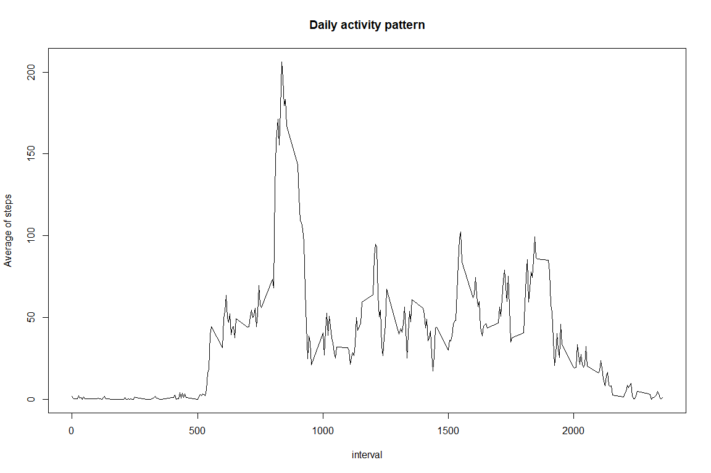
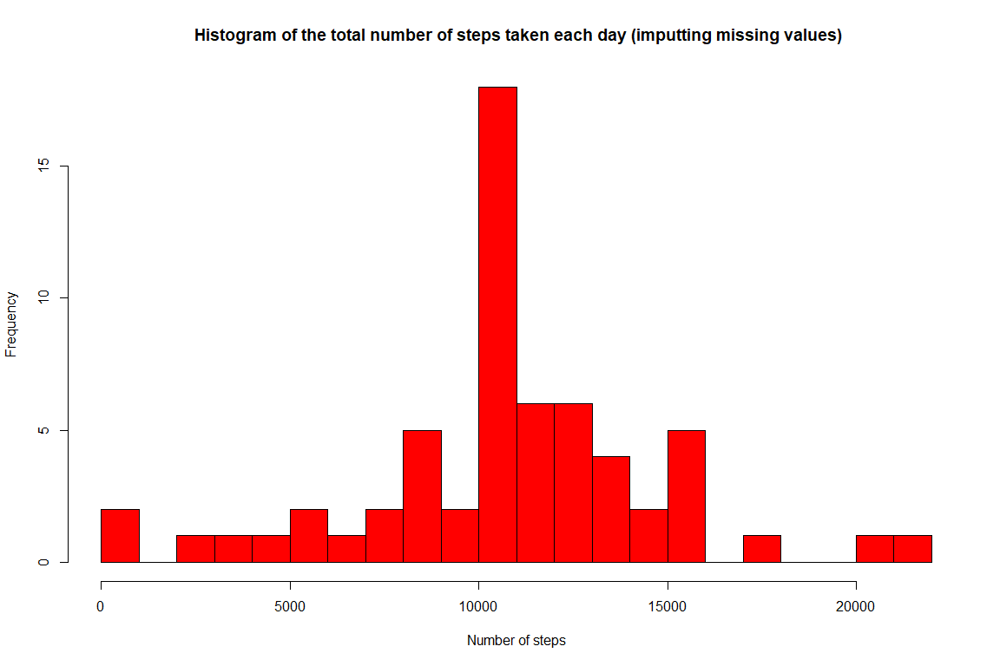
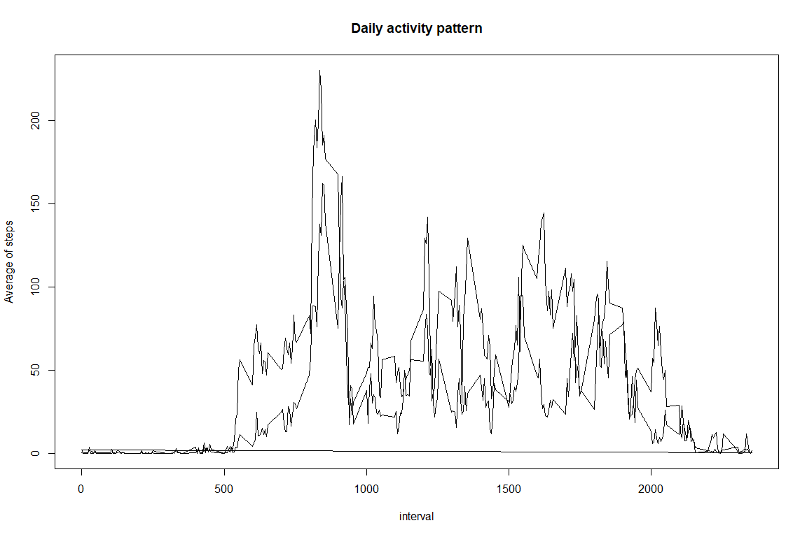

# Reproducible Research: Peer Assessment 1
Pedro A. Alonso Baigorri  
22/05/2017  
## Introduction
This document describes the analysis done for the 1st practice of the Reproducible Research Course, part of the Data Science specialization in course.

The objectives of the exercice are described in the README.md file on this repository.


## Setting global options


## Loading and preprocessing the data

```r
setwd('.')
unzip("activity.zip")
steps_dataset <- read.csv("activity.csv")
steps_dataset$dateformat <- as.Date(steps_dataset$date, "%Y-%m-%d")
head(steps_dataset)
```

```
##   steps       date interval dateformat
## 1    NA 2012-10-01        0 2012-10-01
## 2    NA 2012-10-01        5 2012-10-01
## 3    NA 2012-10-01       10 2012-10-01
## 4    NA 2012-10-01       15 2012-10-01
## 5    NA 2012-10-01       20 2012-10-01
## 6    NA 2012-10-01       25 2012-10-01
```

## Histogram of the total number of steps taken each day
The purpose of the histogram is to know what's the frecuency (number of days) where an specific value of the total steps has occured during all the period of analysis. In summary I will represent a barplot where the y-axis is the frequency (number of days) and the x-axis the different values of total  number of steps.

To do this I will calculate first the total number of the steps by day and then plot an histogram using the hist() function.


```r
steps_by_day <- aggregate(steps ~ date, data = steps_dataset, FUN = sum )
head(steps_by_day)
```

```
##         date steps
## 1 2012-10-02   126
## 2 2012-10-03 11352
## 3 2012-10-04 12116
## 4 2012-10-05 13294
## 5 2012-10-06 15420
## 6 2012-10-07 11015
```

```r
hist(steps_by_day$steps, breaks=30, col=c("red"), xlab = "Number of steps", main =" Histogram of the total number of steps taken each day")
```

<!-- -->

## What is the mean and median of  total number of steps taken per day?

Using the agreggated data calculated before, the mean and the median can be calculated as follows:


```r
mean_steps <- mean(steps_by_day$steps)
median_steps <- median(steps_by_day$steps)
```

This provides the following results:  
  
- Mean = 1.0766189\times 10^{4}  
- Median = 10765


## What is the average daily activity pattern?
To analyze the average daily activity pattern first of all I will make a time series plot of the 5-minute interval (x-axis) and the average number of steps taken, averaged across all days (y-axis)


```r
steps_by_interval <- aggregate(steps ~ interval, data = steps_dataset, FUN = mean )
head(steps_by_interval)
```

```
##   interval     steps
## 1        0 1.7169811
## 2        5 0.3396226
## 3       10 0.1320755
## 4       15 0.1509434
## 5       20 0.0754717
## 6       25 2.0943396
```

```r
plot(steps_by_interval$interval, steps_by_interval$steps,  ylab = "Average of steps", xlab = "interval", type = "l", main = "Daily activity pattern")
```

<!-- -->

Now I'll calculate the maximum value and  interval when this maximum number happens

```r
max_steps <- max(steps_by_interval$steps)

id_max_interval <- which(steps_by_interval$steps == max_steps)
max_interval <- steps_by_interval[max(id_max_interval), "interval"]

#another way to calculate the max_interval
max_interval <- steps_by_interval[steps_by_interval$steps==max_steps,"interval"]
```

The max avg steps are: 206.1698113.  
The interval when the max avg step happens is: 835


## Imputing missing values
Now I wll analyze the impact of missing values in the dataset. To do this first of all I'll calculate the total number of NA's in the dataset and how they are distributed.


```r
# calculation of number of intervals with NA's per day
nas <- steps_dataset[is.na(steps_dataset$steps),]
nas$count <- 0
head(nas)
```

```
##   steps       date interval dateformat count
## 1    NA 2012-10-01        0 2012-10-01     0
## 2    NA 2012-10-01        5 2012-10-01     0
## 3    NA 2012-10-01       10 2012-10-01     0
## 4    NA 2012-10-01       15 2012-10-01     0
## 5    NA 2012-10-01       20 2012-10-01     0
## 6    NA 2012-10-01       25 2012-10-01     0
```

```r
nas_by_day <- aggregate(count ~ date, data = nas, FUN = length )
print(nas_by_day)
```

```
##         date count
## 1 2012-10-01   288
## 2 2012-10-08   288
## 3 2012-11-01   288
## 4 2012-11-04   288
## 5 2012-11-09   288
## 6 2012-11-10   288
## 7 2012-11-14   288
## 8 2012-11-30   288
```

```r
# calculation of number of total intervals with or without NA's per day
steps_dataset$count <- 0
intervals_by_day <- aggregate(count ~ date, data = steps_dataset, FUN = length )
head(intervals_by_day)
```

```
##         date count
## 1 2012-10-01   288
## 2 2012-10-02   288
## 3 2012-10-03   288
## 4 2012-10-04   288
## 5 2012-10-05   288
## 6 2012-10-06   288
```

We can see that there is always the same value NAs for each day: 288, and it's the same of the total number of intervals per day.
288.  This demonstrates that there are not single missing values inside the days, only full days with all the intervals missing.

So, to imput missing values to the missing days , I can assign for each missing 
day the average of the rest of the days per each interval.


```r
steps_dataset_clean <- steps_dataset
steps_dataset_clean[is.na(steps_dataset$steps), "steps"] <- as.integer(steps_by_interval$steps)
head(steps_dataset_clean)
```

```
##   steps       date interval dateformat count
## 1     1 2012-10-01        0 2012-10-01     0
## 2     0 2012-10-01        5 2012-10-01     0
## 3     0 2012-10-01       10 2012-10-01     0
## 4     0 2012-10-01       15 2012-10-01     0
## 5     0 2012-10-01       20 2012-10-01     0
## 6     2 2012-10-01       25 2012-10-01     0
```

Now calculate the histogram, mean and median with the new data: 

```r
steps_by_day <- aggregate(steps ~ date, data = steps_dataset_clean, FUN = sum )
head(steps_by_day)
```

```
##         date steps
## 1 2012-10-01 10641
## 2 2012-10-02   126
## 3 2012-10-03 11352
## 4 2012-10-04 12116
## 5 2012-10-05 13294
## 6 2012-10-06 15420
```

```r
hist(steps_by_day$steps, breaks=30, col=c("red"), xlab = "Number of steps", 
     main =" Histogram of the total number of steps taken each day (imputting missing values)")
```

<!-- -->

```r
mean_steps_clean <- mean(steps_by_day$steps)
median_steps_clean <- median(steps_by_day$steps)
```

This provides the following results:  

(With imputation)
  
- Mean = 1.074977\times 10^{4}  
- Median = 10641

(Without imputation)
  
- Mean = 1.0766189\times 10^{4}  
- Median = 10765


## Are there differences in activity patterns between weekdays and weekends?

First, I'll create a new factor variable in the dataset with two levels - 
"weekday" and "weekend" indicating whether a given date is a weekday or weekend day.


```r
steps_dataset_clean$wday <- weekdays(steps_dataset_clean$dateformat)
steps_dataset_clean$weekend <- ifelse((steps_dataset_clean$wday == "sábado") | 
                                          (steps_dataset_clean$wday == "domingo"), "WEEKEND", "WORKDAY")
```

Then I'll make a panel plot containing a time series plot (i.e. type = "l") of 
the 5-minute interval (x-axis) and the average number of steps taken, averaged 
across all weekday days or weekend days (y-axis)


```r
steps_by_interval_weekend<- aggregate(steps ~ interval + weekend, 
                                    data = steps_dataset_clean, FUN = mean )
head(steps_by_interval_weekend)
```

```
##   interval weekend steps
## 1        0 WEEKEND 0.125
## 2        5 WEEKEND 0.000
## 3       10 WEEKEND 0.000
## 4       15 WEEKEND 0.000
## 5       20 WEEKEND 0.000
## 6       25 WEEKEND 3.500
```

```r
library(ggplot2)

ggplot(data = steps_by_interval_weekend, aes(x=interval, y=steps, group=weekend)) +
    geom_line(aes(color=weekend)) + 
    facet_wrap(~ weekend, nrow = 2 ) +
    ylab("Average of steps") + 
    xlab("Interval") +
    ggtitle("Differences in activity patterns between weekdays and weekends") +
    theme(legend.position="none")
```

<!-- -->
The plot shows how the patterns are very different betweek weekends and workdays.   

During the workdays there the maximum of the steps are mainly during the first hours in the morning while during the weekends the steps are more distributed along all the day.
