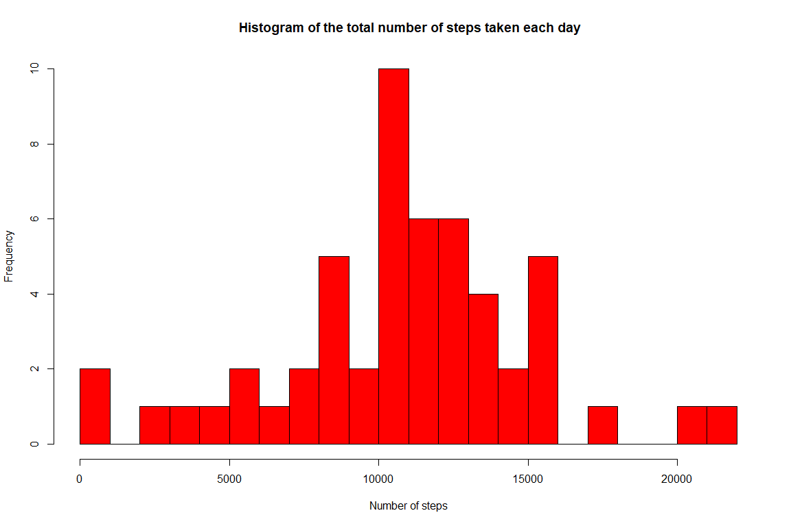

# Reproducible Research: Peer Assessment 1
Pedro A. Alonso Baigorri  
22/05/2017  
## Introduction
This document describes the analysis done for the 1st practice of the Reproducible Research Course, part of the Data Science specialization in course.

The objectives of the exercice are described in the README.md file on this repository.


## Setting global options


## Loading and preprocessing the data

```r
setwd('.')
unzip("activity.zip")
steps_dataset <- read.csv("activity.csv")
head(steps_dataset)
```

```
##   steps       date interval
## 1    NA 2012-10-01        0
## 2    NA 2012-10-01        5
## 3    NA 2012-10-01       10
## 4    NA 2012-10-01       15
## 5    NA 2012-10-01       20
## 6    NA 2012-10-01       25
```

## Histogram of the total number of steps taken each day
The purpose of the histogram is to know what's the frecuency (number of days) where an specific value of the total steps has occured during all the period of analysis. In summary I will represent a barplot where the y-axis is the frequency (number of days) and the x-axis the different values of total  number of steps.

To do this I will calculate first the total number of the steps by day and then plot an histogram using the hist() function.


```r
steps_by_day <- aggregate(steps ~ date, data = steps_dataset, FUN = sum )
head(steps_by_day)
```

```
##         date steps
## 1 2012-10-02   126
## 2 2012-10-03 11352
## 3 2012-10-04 12116
## 4 2012-10-05 13294
## 5 2012-10-06 15420
## 6 2012-10-07 11015
```

```r
hist(steps_by_day$steps, breaks=30, col=c("red"), xlab = "Number of steps", main =" Histogram of the total number of steps taken each day")
```

<!-- -->

## What is the mean and median of  total number of steps taken per day?

```r
mean_steps <- mean(steps_by_day$steps)
median_steps <- median(steps_by_day$steps)
```
The mean is 1.0766189\times 10^{4}and the median is 10765


## What is the average daily activity pattern?


## Imputing missing values


## Are there differences in activity patterns between weekdays and weekends?
